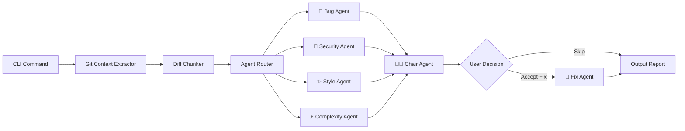
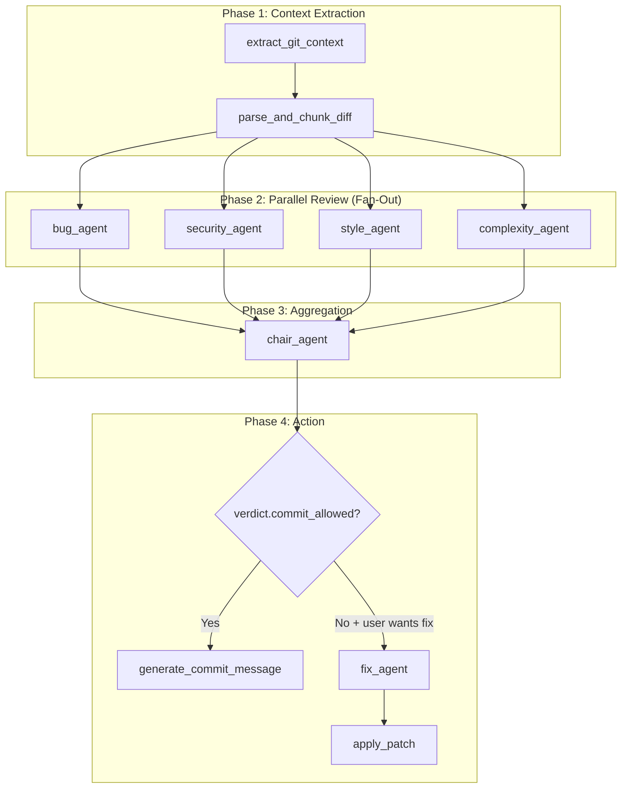

# git-sage — AI-Powered Git Assistant: Implementation Plan

## Overview

**git-sage** is a Python CLI tool that integrates AI-powered multi-agent code review, commit generation, bug tracing, and changelog creation directly into the Git workflow. It uses a LangGraph-based parallel agent pipeline to analyze code changes from multiple perspectives (bugs, security, style, complexity) and synthesize actionable results.

### Competitive Landscape

| Tool | Approach | git-sage Differentiator |
|---|---|---|
| **PR Agent (Qodo)** | PR-focused, GitHub/GitLab integration | git-sage is **local-first**, no PR needed — works on staged changes before push |
| **Open Code Review** | Hybrid deterministic + LLM | git-sage has **specialized multi-agent pipeline** with transparent agent verdicts |
| **Gito** | Privacy-first, stateless | git-sage adds **AI Blame** and **Changelog** — features competitors lack |
| **aicommits** | Commit message only | git-sage is a **full review + fix + blame + changelog suite** |

> [!IMPORTANT]
> git-sage's unique value: **local-first multi-agent review** + **AI Blame** (error → commit tracing) + **auto-fix with approval** — no existing open-source tool combines all three.

---

## User Review Required

> [!WARNING]
> **LLM Provider Decision**: The plan defaults to supporting **OpenAI, Google Gemini, and Ollama (local)**. If you want to limit to a single provider initially, let me know — it affects the abstraction layer complexity.

> [!IMPORTANT]
> **Packaging Decision**: The plan uses **`uv`** for dependency management and **`pyproject.toml`** for metadata. If you prefer **Poetry** or plain **pip + setuptools**, I can adjust.

> [!IMPORTANT]
> **Name Availability**: `git-sage` needs to be checked on PyPI before publishing. If taken, alternatives: `gitsage`, `git-sage-ai`, `sage-git`.

---

## Open Questions

1. **Target Python version?** Plan assumes **Python 3.10+** for `match` statements and modern typing.
2. **Default LLM model?** Plan uses `gpt-4o-mini` as default (cheap + fast). Should `gpt-4o` or Gemini be default?
3. **Git hook auto-install?** Should `git-sage init` auto-install a pre-commit hook, or keep it opt-in?
4. **Pricing transparency?** Should each command show estimated token cost before execution?
5. **Do you want a `--dry-run` mode** that shows what agents would analyze without calling the LLM?

---

## Tech Stack

| Layer | Choice | Rationale |
|---|---|---|
| **Language** | Python 3.10+ | LangGraph/LangChain ecosystem, rich CLI libraries |
| **CLI Framework** | [Typer](https://typer.tiangolo.com/) + [Rich](https://github.com/Textualize/rich) | Auto-generated help, type hints, beautiful terminal output |
| **Agent Orchestration** | [LangGraph](https://langchain-ai.github.io/langgraph/) | Native parallel fan-out, state management, conditional edges |
| **LLM Interface** | [LangChain Chat Models](https://python.langchain.com/docs/integrations/chat/) | Unified interface for OpenAI, Gemini, Ollama, etc. |
| **Structured Output** | Pydantic v2 + `with_structured_output()` | Type-safe agent responses with validation |
| **Git Interaction** | [GitPython](https://gitpython.readthedocs.io/) | Repository access, diff extraction, log parsing |
| **Diff Parsing** | [unidiff](https://github.com/matiasb/python-unidiff) | Line-level diff analysis for precise findings |
| **Config** | TOML (`~/.gitsagerc` + `.gitsage.toml`) | Per-user + per-project config |
| **Packaging** | `uv` + `pyproject.toml` | Modern Python packaging with fast dependency resolution |
| **Testing** | `pytest` + `pytest-asyncio` | Standard Python testing |
| **Linting** | `ruff` | Fast, all-in-one linter + formatter |

---

## Architecture

### High-Level Flow



### LangGraph State Design

```python
from typing import TypedDict, Annotated
from pydantic import BaseModel, Field
import operator

# --- Pydantic models for structured agent output ---

class Finding(BaseModel):
    """A single issue found by an agent."""
    agent: str = Field(description="Agent that found this issue")
    severity: str = Field(description="critical | warning | info")
    category: str = Field(description="bug | security | style | complexity")
    file: str = Field(description="Affected file path")
    line_start: int = Field(description="Start line number")
    line_end: int = Field(description="End line number")
    message: str = Field(description="Human-readable description")
    suggestion: str = Field(description="Recommended fix")
    confidence: float = Field(ge=0.0, le=1.0, description="Confidence score")
    code_snippet: str = Field(default="", description="Relevant code")

class AgentReport(BaseModel):
    """Output from a single review agent."""
    agent_name: str
    findings: list[Finding] = []
    summary: str = Field(description="Brief summary of agent's assessment")
    pass_fail: str = Field(description="pass | fail | warn")

class Verdict(BaseModel):
    """Final aggregated verdict from Chair Agent."""
    overall_status: str = Field(description="pass | fail | warn")
    critical_count: int
    warning_count: int
    info_count: int
    summary: str
    findings: list[Finding]
    commit_allowed: bool

# --- LangGraph State (TypedDict with reducers) ---

class ReviewState(TypedDict):
    diff_text: str                                              # Raw diff
    diff_chunks: list[dict]                                     # Parsed chunks
    file_context: dict[str, str]                                # Full file contents for context
    agent_reports: Annotated[list[AgentReport], operator.add]   # Parallel-safe append
    verdict: Verdict | None                                     # Chair agent output
    fix_patches: list[str]                                      # Generated patches
    commit_message: str                                         # Generated commit message
    error: str | None                                           # Error state
```

### Agent Pipeline Detail



### Fan-Out Implementation (LangGraph)

```python
from langgraph.graph import StateGraph, END
from langgraph.types import Send

def route_to_agents(state: ReviewState):
    """Fan-out to all review agents in parallel."""
    agents = ["bug_agent", "security_agent", "style_agent", "complexity_agent"]
    return [Send(agent, state) for agent in agents]

# Build the graph
graph = StateGraph(ReviewState)
graph.add_node("extract_context", extract_git_context)
graph.add_node("chunk_diff", parse_and_chunk_diff)
graph.add_node("bug_agent", bug_agent_node)
graph.add_node("security_agent", security_agent_node)
graph.add_node("style_agent", style_agent_node)
graph.add_node("complexity_agent", complexity_agent_node)
graph.add_node("chair_agent", chair_agent_node)

graph.set_entry_point("extract_context")
graph.add_edge("extract_context", "chunk_diff")
graph.add_conditional_edges("chunk_diff", route_to_agents)
graph.add_edge(["bug_agent", "security_agent", "style_agent", "complexity_agent"], "chair_agent")
graph.add_edge("chair_agent", END)
```

---

## Project Structure

```
git-sage/
├── .github/
│   └── workflows/
│       ├── ci.yml                    # Lint + test on PR
│       └── publish.yml               # PyPI publish on tag
├── src/
│   └── git_sage/
│       ├── __init__.py               # Version info
│       ├── main.py                   # Typer app entry point
│       ├── commands/                 # CLI command handlers
│       │   ├── __init__.py
│       │   ├── review.py             # git-sage review
│       │   ├── commit.py             # git-sage commit
│       │   ├── explain.py            # git-sage explain
│       │   ├── blame.py              # git-sage blame
│       │   ├── changelog.py          # git-sage changelog
│       │   ├── fix.py                # git-sage fix
│       │   └── config_cmd.py         # git-sage config
│       ├── agents/                   # LangGraph agent definitions
│       │   ├── __init__.py
│       │   ├── graph.py              # Main LangGraph pipeline
│       │   ├── state.py              # State & Pydantic schemas
│       │   ├── bug_agent.py          # 🐛 Bug detection
│       │   ├── security_agent.py     # 🔐 Security analysis
│       │   ├── style_agent.py        # ✨ Style review
│       │   ├── complexity_agent.py   # ⚡ Complexity evaluation
│       │   ├── fix_agent.py          # 🔧 Patch generation
│       │   ├── chair_agent.py        # 👨‍⚖️ Aggregation & verdict
│       │   └── prompts/              # Agent system prompts (Markdown)
│       │       ├── bug.md
│       │       ├── security.md
│       │       ├── style.md
│       │       ├── complexity.md
│       │       ├── chair.md
│       │       └── fix.md
│       ├── git/                      # Git interaction layer
│       │   ├── __init__.py
│       │   ├── context.py            # Extract diffs, logs, blame
│       │   ├── diff_parser.py        # Parse diffs with unidiff
│       │   └── patch.py              # Apply generated patches
│       ├── llm/                      # LLM provider abstraction
│       │   ├── __init__.py
│       │   ├── provider.py           # Provider factory
│       │   └── models.py             # Model configuration
│       ├── config/                   # Configuration system
│       │   ├── __init__.py
│       │   ├── settings.py           # Pydantic settings model
│       │   └── defaults.py           # Default configuration
│       ├── output/                   # Terminal output formatting
│       │   ├── __init__.py
│       │   ├── console.py            # Rich console setup
│       │   ├── review_report.py      # Review output renderer
│       │   ├── changelog_report.py   # Changelog renderer
│       │   └── spinners.py           # Loading animations
│       └── utils/                    # Shared utilities
│           ├── __init__.py
│           ├── tokens.py             # Token counting & cost estimation
│           └── chunker.py            # Diff chunking strategies
├── tests/
│   ├── __init__.py
│   ├── conftest.py                   # Shared fixtures
│   ├── test_commands/
│   │   ├── test_review.py
│   │   ├── test_commit.py
│   │   └── test_blame.py
│   ├── test_agents/
│   │   ├── test_bug_agent.py
│   │   ├── test_chair_agent.py
│   │   └── test_graph.py
│   ├── test_git/
│   │   ├── test_context.py
│   │   └── test_diff_parser.py
│   └── fixtures/                     # Sample diffs, repos
│       ├── sample_diff.patch
│       └── sample_repo/
├── pyproject.toml                    # Project metadata & dependencies
├── README.md
├── LICENSE                           # MIT
├── .gitignore
└── agents.md                         # Original spec (preserved)
```

---

## CLI Commands Specification

### `git-sage review`
Review staged changes before committing.

```bash
# Basic review
git-sage review

# Review with auto-fix suggestions
git-sage review --fix

# Filter by severity
git-sage review --severity critical

# Only run specific agents
git-sage review --agents bug,security

# Fast mode (bug + security only)
git-sage review --fast

# Show estimated cost before running
git-sage review --estimate
```

**Output Example (Rich-formatted):**
```
╭─────────────────────── git-sage review ───────────────────────╮
│  Analyzing 3 files • 47 lines changed                        │
╰───────────────────────────────────────────────────────────────╯

🐛 Bug Agent ─────────────────────────────────────────── WARN
  ⚠ auth.py:23-27  Missing null check on user.email
    → Add `if user.email is None: raise ValueError(...)`
    Confidence: 0.87

🔐 Security Agent ────────────────────────────────────── FAIL
  🚨 config.py:12  Hardcoded API key detected
    → Move to environment variable: os.getenv("API_KEY")
    Confidence: 0.95

✨ Style Agent ───────────────────────────────────────── PASS
  ✓ No style issues detected.

⚡ Complexity Agent ──────────────────────────────────── PASS
  ✓ All functions within acceptable complexity.

╭─────────────────────── Final Verdict ─────────────────────────╮
│  ❌ FAIL — 1 critical, 1 warning, 0 info                     │
│  Fix critical issues before committing.                       │
│                                                               │
│  [f] Auto-fix  [s] Skip  [d] Details  [q] Quit               │
╰───────────────────────────────────────────────────────────────╯
```

---

### `git-sage commit`
Generate a semantic commit message from staged changes.

```bash
# Generate and apply commit message
git-sage commit

# Generate with conventional commits format
git-sage commit --style conventional

# Generate with a custom prefix
git-sage commit --prefix "feat(auth):"

# Preview without committing
git-sage commit --dry-run
```

---

### `git-sage explain <sha>`
Explain any commit in plain English.

```bash
git-sage explain abc123
git-sage explain HEAD~3
git-sage explain --verbose abc123    # Include motivation analysis
```

---

### `git-sage blame <error>`
Trace a runtime error to the most likely responsible commit.

```bash
# Trace from error message
git-sage blame "TypeError: cannot read property 'name' of undefined"

# Trace from a specific file
git-sage blame --file src/auth.py "KeyError: 'token'"

# Include fix suggestion
git-sage blame --fix "IndexError: list index out of range"
```

---

### `git-sage changelog`
Generate release notes from Git history.

```bash
# Generate from last tag to HEAD
git-sage changelog

# Between specific versions
git-sage changelog --from v1.0.0 --to v2.0.0

# Output format
git-sage changelog --format markdown    # default
git-sage changelog --format json
git-sage changelog --format keep-a-changelog
```

---

### `git-sage config`
Manage git-sage settings.

```bash
# Set LLM provider
git-sage config set llm.provider openai
git-sage config set llm.model gpt-4o-mini
git-sage config set llm.api_key sk-...

# Use local Ollama
git-sage config set llm.provider ollama
git-sage config set llm.model codellama

# Disable agents
git-sage config set agents.style.enabled false

# View current config
git-sage config show
```

---

## Configuration System

### Hierarchy (lowest to highest priority)
1. **Built-in defaults** (`src/git_sage/config/defaults.py`)
2. **Global config** (`~/.gitsagerc` or `~/.config/git-sage/config.toml`)
3. **Project config** (`.gitsage.toml` in repo root)
4. **Environment variables** (`GITSAGE_LLM_PROVIDER`, `GITSAGE_API_KEY`, etc.)
5. **CLI flags** (`--model`, `--provider`, etc.)

### Example `.gitsage.toml`
```toml
[llm]
provider = "openai"          # openai | gemini | ollama
model = "gpt-4o-mini"
api_key_env = "OPENAI_API_KEY"  # Read from env var
temperature = 0.1
max_tokens = 4096

[agents]
enabled = ["bug", "security", "style", "complexity"]
parallel = true

[agents.bug]
enabled = true
severity_threshold = "info"  # Only report findings >= this level

[agents.security]
enabled = true
severity_threshold = "warning"

[agents.style]
enabled = true
severity_threshold = "warning"

[agents.complexity]
enabled = true
max_cyclomatic = 10          # Flag functions above this

[review]
max_diff_lines = 2000        # Warn if diff exceeds this
auto_fix = false              # Require explicit --fix flag
show_cost_estimate = true

[commit]
style = "conventional"        # conventional | descriptive | emoji
max_length = 72               # Subject line max length

[changelog]
categories = ["feat", "fix", "refactor", "docs", "perf", "test"]
format = "keep-a-changelog"

[output]
color = true
verbose = false
```

---

## Phased Build Roadmap

### Phase 1: Foundation (Week 1-2)
> Core infrastructure — project setup, Git layer, config system, CLI skeleton

| Task | Files |
|---|---|
| Initialize project with `uv`, `pyproject.toml` | Root config files |
| Set up Typer CLI with subcommand routing | `main.py`, `commands/` |
| Build Git context extractor (staged diff, commit log) | `git/context.py` |
| Build diff parser with `unidiff` | `git/diff_parser.py` |
| Implement TOML config system with Pydantic | `config/settings.py` |
| Set up Rich console output framework | `output/console.py` |
| Write unit tests for git + config layers | `tests/` |

**Deliverable:** `git-sage review` runs and extracts diffs (no AI yet).

---

### Phase 2: Agent Pipeline (Week 3-4)
> LangGraph multi-agent system with parallel fan-out

| Task | Files |
|---|---|
| Define state schema + Pydantic output models | `agents/state.py` |
| Build LLM provider factory (OpenAI, Gemini, Ollama) | `llm/provider.py` |
| Implement Bug Agent with prompt + structured output | `agents/bug_agent.py` |
| Implement Security Agent | `agents/security_agent.py` |
| Implement Style Agent | `agents/style_agent.py` |
| Implement Complexity Agent | `agents/complexity_agent.py` |
| Implement Chair Agent (aggregation + verdict) | `agents/chair_agent.py` |
| Wire LangGraph pipeline with fan-out | `agents/graph.py` |
| Build review report renderer | `output/review_report.py` |
| Token counting + cost estimation | `utils/tokens.py` |

**Deliverable:** `git-sage review` produces a full AI-powered review with findings.

---

### Phase 3: Fix + Commit (Week 5-6)
> Auto-fix, commit message generation, interactive UX

| Task | Files |
|---|---|
| Implement Fix Agent (patch generation) | `agents/fix_agent.py` |
| Build patch application logic | `git/patch.py` |
| Build interactive approval UX (Rich prompts) | `commands/review.py` |
| Implement commit message generation | `commands/commit.py` |
| Add `--fix`, `--fast`, `--estimate` flags | `commands/review.py` |

**Deliverable:** `git-sage review --fix` and `git-sage commit` fully functional.

---

### Phase 4: Explain + Blame + Changelog (Week 7-8)
> Advanced Git analysis features

| Task | Files |
|---|---|
| Implement commit explanation | `commands/explain.py` |
| Implement AI Blame (error → commit tracing) | `commands/blame.py` |
| Implement changelog generation | `commands/changelog.py` |
| Build changelog renderer | `output/changelog_report.py` |

**Deliverable:** All 6 commands fully functional.

---

### Phase 5: Polish + Ship (Week 9-10)
> Testing, documentation, packaging, release

| Task | Files |
|---|---|
| Integration tests with mock LLM responses | `tests/` |
| CI/CD with GitHub Actions | `.github/workflows/` |
| README with installation + usage | `README.md` |
| PyPI packaging + publish workflow | `pyproject.toml`, `.github/` |
| Git hook integration (`git-sage init`) | `commands/init.py` |
| Error handling + graceful degradation | All files |

**Deliverable:** Published on PyPI, installable via `pip install git-sage`.

---

## Token Limit & Cost Management Strategy

| Strategy | Implementation |
|---|---|
| **Chunk by file** | Split large diffs into per-file chunks, review independently |
| **Max diff guard** | Warn if diff > 2000 lines, require `--force` to proceed |
| **Token estimation** | Pre-calculate tokens with `tiktoken` before sending |
| **Cost display** | Show `~$0.003 estimated cost` before LLM calls |
| **Smart context** | Only include full file content when agent needs it (e.g., bug agent) |
| **Caching** | Cache reviews of unchanged files using content hash |
| **Fast mode** | `--fast` runs only Bug + Security agents (skip style/complexity) |

---

## Proposed Dependencies

```toml
[project]
name = "git-sage"
version = "0.1.0"
requires-python = ">=3.10"
dependencies = [
    "typer[all]>=0.12",
    "rich>=13.0",
    "langgraph>=0.2",
    "langchain-core>=0.3",
    "langchain-openai>=0.2",
    "langchain-google-genai>=2.0",
    "gitpython>=3.1",
    "unidiff>=0.7",
    "pydantic>=2.0",
    "pydantic-settings>=2.0",
    "tiktoken>=0.7",
    "tomli>=2.0; python_version < '3.11'",
]

[project.optional-dependencies]
ollama = ["langchain-ollama>=0.2"]
dev = ["pytest>=8.0", "pytest-asyncio>=0.23", "ruff>=0.5", "mypy>=1.10"]

[project.scripts]
git-sage = "git_sage.main:app"
```

---

## Verification Plan

### Automated Tests
```bash
# Unit tests
uv run pytest tests/ -v

# Lint
uv run ruff check src/

# Type checking
uv run mypy src/git_sage/
```

### Manual Verification
- Stage a file with a known bug → run `git-sage review` → verify Bug Agent catches it
- Stage a file with a hardcoded secret → verify Security Agent flags it
- Run `git-sage commit` → verify generated message matches changes
- Run `git-sage explain HEAD` → verify explanation is accurate
- Run `git-sage changelog --from <tag>` → verify categorized output
- Test with Ollama local model → verify offline mode works
- Test on a repo with 50+ changed files → verify chunking and cost guard
