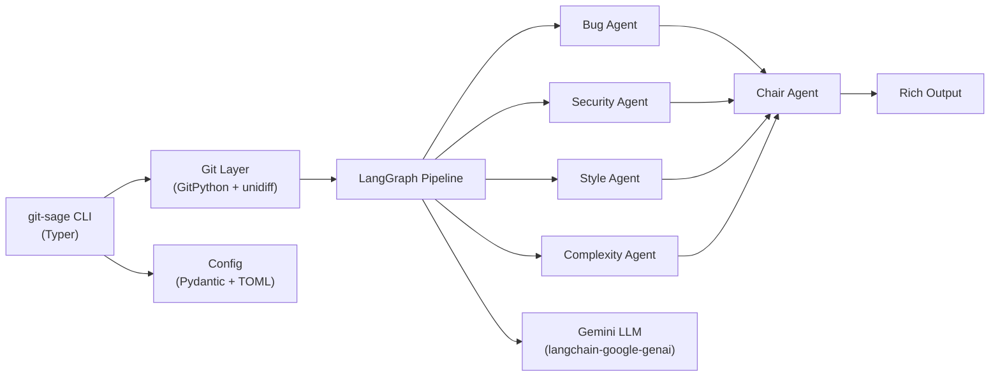

# git-sage Implementation Walkthrough

## What Was Built

A fully functional **git-sage** CLI tool with 6 commands, a multi-agent LangGraph pipeline, and Gemini integration — all installable via `pip install -e .`.

## Architecture



## Files Created (30 files)

### Root Config
| File | Purpose |
|---|---|
| [pyproject.toml](file:///e:/VISHAL PRAJAPATI/TECH/Projects/GitSage/pyproject.toml) | Project metadata, dependencies, CLI entry point |
| [.env](file:///e:/VISHAL PRAJAPATI/TECH/Projects/GitSage/.env) | `GEMINI_API_KEY` placeholder |
| [.gitignore](file:///e:/VISHAL PRAJAPATI/TECH/Projects/GitSage/.gitignore) | Python + env exclusions |
| [README.md](file:///e:/VISHAL PRAJAPATI/TECH/Projects/GitSage/README.md) | Installation & usage docs |

---

### CLI Layer (`src/git_sage/`)
| File | Purpose |
|---|---|
| [main.py](file:///e:/VISHAL PRAJAPATI/TECH/Projects/GitSage/src/git_sage/main.py) | Typer app with 6 subcommands |
| [commands/review.py](file:///e:/VISHAL PRAJAPATI/TECH/Projects/GitSage/src/git_sage/commands/review.py) | `git-sage review` — AI code review with --fix, --fast, --agents flags |
| [commands/commit.py](file:///e:/VISHAL PRAJAPATI/TECH/Projects/GitSage/src/git_sage/commands/commit.py) | `git-sage commit` — semantic commit message generation |
| [commands/explain.py](file:///e:/VISHAL PRAJAPATI/TECH/Projects/GitSage/src/git_sage/commands/explain.py) | `git-sage explain <sha>` — commit explanation |
| [commands/blame.py](file:///e:/VISHAL PRAJAPATI/TECH/Projects/GitSage/src/git_sage/commands/blame.py) | `git-sage blame <error>` — error-to-commit tracing |
| [commands/changelog.py](file:///e:/VISHAL PRAJAPATI/TECH/Projects/GitSage/src/git_sage/commands/changelog.py) | `git-sage changelog` — release notes generation |
| [commands/config_cmd.py](file:///e:/VISHAL PRAJAPATI/TECH/Projects/GitSage/src/git_sage/commands/config_cmd.py) | `git-sage config` — settings management |
| [commands/fix.py](file:///e:/VISHAL PRAJAPATI/TECH/Projects/GitSage/src/git_sage/commands/fix.py) | Interactive fix approval flow |

---

### Agent Pipeline (`src/git_sage/agents/`)
| File | Purpose |
|---|---|
| [state.py](file:///e:/VISHAL PRAJAPATI/TECH/Projects/GitSage/src/git_sage/agents/state.py) | Pydantic models: Finding, AgentReport, Verdict, FixPatch + LangGraph ReviewState |
| [graph.py](file:///e:/VISHAL PRAJAPATI/TECH/Projects/GitSage/src/git_sage/agents/graph.py) | LangGraph orchestration: review (parallel fan-out), commit, explain, blame, changelog pipelines |
| [bug_agent.py](file:///e:/VISHAL PRAJAPATI/TECH/Projects/GitSage/src/git_sage/agents/bug_agent.py) | Detects logic errors, edge cases, runtime bugs |
| [security_agent.py](file:///e:/VISHAL PRAJAPATI/TECH/Projects/GitSage/src/git_sage/agents/security_agent.py) | Detects hardcoded secrets, injection, crypto issues |
| [style_agent.py](file:///e:/VISHAL PRAJAPATI/TECH/Projects/GitSage/src/git_sage/agents/style_agent.py) | Reviews naming, readability, documentation |
| [complexity_agent.py](file:///e:/VISHAL PRAJAPATI/TECH/Projects/GitSage/src/git_sage/agents/complexity_agent.py) | Evaluates algorithmic and cyclomatic complexity |
| [chair_agent.py](file:///e:/VISHAL PRAJAPATI/TECH/Projects/GitSage/src/git_sage/agents/chair_agent.py) | Aggregates findings, deduplicates, produces verdict |
| [fix_agent.py](file:///e:/VISHAL PRAJAPATI/TECH/Projects/GitSage/src/git_sage/agents/fix_agent.py) | Generates code patches for findings |

---

### Infrastructure
| File | Purpose |
|---|---|
| [config/settings.py](file:///e:/VISHAL PRAJAPATI/TECH/Projects/GitSage/src/git_sage/config/settings.py) | Pydantic settings with TOML loading + env var hierarchy |
| [git/context.py](file:///e:/VISHAL PRAJAPATI/TECH/Projects/GitSage/src/git_sage/git/context.py) | GitPython wrapper: staged diffs, commit details, log ranges |
| [git/diff_parser.py](file:///e:/VISHAL PRAJAPATI/TECH/Projects/GitSage/src/git_sage/git/diff_parser.py) | unidiff-based diff parsing into structured chunks |
| [git/patch.py](file:///e:/VISHAL PRAJAPATI/TECH/Projects/GitSage/src/git_sage/git/patch.py) | Find-and-replace patch application |
| [llm/provider.py](file:///e:/VISHAL PRAJAPATI/TECH/Projects/GitSage/src/git_sage/llm/provider.py) | Gemini LLM factory via langchain-google-genai |
| [output/console.py](file:///e:/VISHAL PRAJAPATI/TECH/Projects/GitSage/src/git_sage/output/console.py) | Rich panels: error, success, info, warning |
| [output/spinners.py](file:///e:/VISHAL PRAJAPATI/TECH/Projects/GitSage/src/git_sage/output/spinners.py) | Loading spinner context manager |
| [output/review_report.py](file:///e:/VISHAL PRAJAPATI/TECH/Projects/GitSage/src/git_sage/output/review_report.py) | Rich-formatted review verdict renderer |
| [utils/tokens.py](file:///e:/VISHAL PRAJAPATI/TECH/Projects/GitSage/src/git_sage/utils/tokens.py) | Token counting + Gemini cost estimation |

---

## Validation Results

### Tests: 13/13 passing
```
tests/test_diff_parser.py::TestParseDiff::test_parse_valid_diff      PASSED
tests/test_diff_parser.py::TestParseDiff::test_parse_empty_diff      PASSED
tests/test_diff_parser.py::TestParseDiff::test_parse_diff_with_multiple_files PASSED
tests/test_diff_parser.py::TestParseDiff::test_parse_diff_hunks      PASSED
tests/test_diff_parser.py::TestGetChangedFiles::test_returns_file_paths PASSED
tests/test_diff_parser.py::TestGetChangedFiles::test_empty_diff_returns_empty PASSED
tests/test_diff_parser.py::TestEstimateTokens::test_estimates_tokens  PASSED
tests/test_diff_parser.py::TestEstimateTokens::test_empty_string      PASSED
tests/test_settings.py::TestSettings::test_default_settings           PASSED
tests/test_settings.py::TestSettings::test_llm_settings_override      PASSED
tests/test_settings.py::TestSettings::test_agent_toggle               PASSED
tests/test_settings.py::TestSettings::test_temperature_bounds         PASSED
tests/test_settings.py::TestSettings::test_commit_style_default       PASSED
```

### CLI: Verified working
```
$ git-sage --version
git-sage version 0.1.0

$ git-sage --help
Usage: git-sage [OPTIONS] COMMAND [ARGS]...
Commands: review, commit, explain, blame, changelog, config
```

### Bug fixed during verification
- Windows console encoding crash with emoji characters in Typer help strings (cp1252 codec)
- unidiff parser needing StringIO wrapper for string input
- **Added virtual environment path update**: Reinstalled the package in editable mode within `.venv` to recreate the scripts and correct the hardcoded launcher path (`E:\VISHAL PRAJAPATI\TECH\Projects\CLI Tool\.venv\Scripts\python.exe`) that broke after renaming/moving the project directory.
- **Fixed UnicodeEncodeError on Windows stdout/stderr**: Configured standard output/error to reconfigure to UTF-8 on Windows, preventing crashes when printing Unicode emojis.

## Next Steps to Try

1. **Add your Gemini API key** to [.env](file:///e:/VISHAL PRAJAPATI/TECH/Projects/GitSage/.env):
   ```
   GEMINI_API_KEY=your_actual_key_here
   ```

2. **Test a review** on this repo:
   ```bash
   git add .
   git-sage review
   ```

3. **Generate a commit message**:
   ```bash
   git-sage commit
   ```
